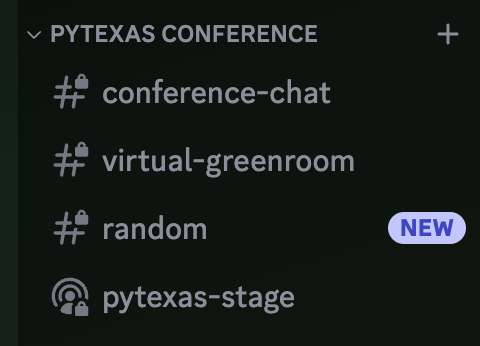

Thank you for attending the PyTexas Conference Virtually! This is our first
year doing a hybrid conference and we're excited to try something a little
different.

The virtual conference portion will be held in the [PyTexas Discord Server](https://discord.gg/jNPAbcNukj)

## Gaining Access to the Correct Channels

1. Join the [PyTexas Discord Server](https://discord.gg/jNPAbcNukj)
1. Check-In and receive the `Conference 2024 Attendees` role
    1. In _any_ text channel you can type the command: `/register EMAIL_ADDRESS`
    where `EMAIL_ADDRESS` is the email address that was used to register your ticket.
        1. When you type the command you should see a prompt for your `attendee_email` like this:
        
        This will send an ephemeral message, meaning only you will be able to see it. 
        1. On success, you should see the output `Registered!`, have the role 
        `Conference 2024 Attendees` added to your profile, and have access to the 
        `PyTexas Conference` section and channels on the left hand nav bar.
        
            1. If this command does not work for you, try a few more times. If 
            that still doesn't work, send and email to [conference@pytexas.org](mailto:conference@pytexas.org).
            1. If you purchased your ticket as part of a group you may be unable to 
            register. Please email [conference@pytexas.org](mailto:conference@pytexas.org) 
            and we'll get this fixed for you.

## Watching the Talks

All talks will be live-streamed in the `pytexas-stage` of the [PyTexas Discord Server](https://discord.gg/jNPAbcNukj).
Stages allow you to join in and listen without the ability to speak or turn on your
camera. When you are in the stage you will be able to see the live stream. To make
it bigger, double click on the video to enlarge it (unfortunately a _true_ fullscreen
option is not available).

{: width="750"}

_In this image Mason is on the stage speaking and presenting the screen. 
You would double click the presentation to make it bigger._

**We _highly_ recommend using the Discord application to view stages.** We have
had people experience issue when trying to use the Discord Web Application with
Stages. For the best expeirience we recommend downloading and installing the 
[Discord App](https://discord.com/).

## Interacting with Other Attendees

We encourage you to interact with your fellow attendees! Networking at conferences
is half the fun! ALl attendees, in-person and virtual, have access to the Discord
server. There is a `#conference-chat` text channel in the `PyTexas Conference` 
section that should be used for conference related discussions. There is also
a `#random` channel for you to use to discuss anything and everything (so long as
it is within our code of conduct.)

**Please keep all discussions appropriate and in accordance with our [Code of Conduct](about/#code-of-conduct)**

## Asking the Speaker Questions

This year we will be using [Slido](https://app.sli.do/event/4PKggGtcHNaQYGFvLkoCxD)
to ask the speaker questions. Slido allows you to submit your question and up-vote
other questions you'd like to hear the answer to. 

[Join the Slido](https://app.sli.do/event/4PKggGtcHNaQYGFvLkoCxD){: .md-button .email-button--primary}
