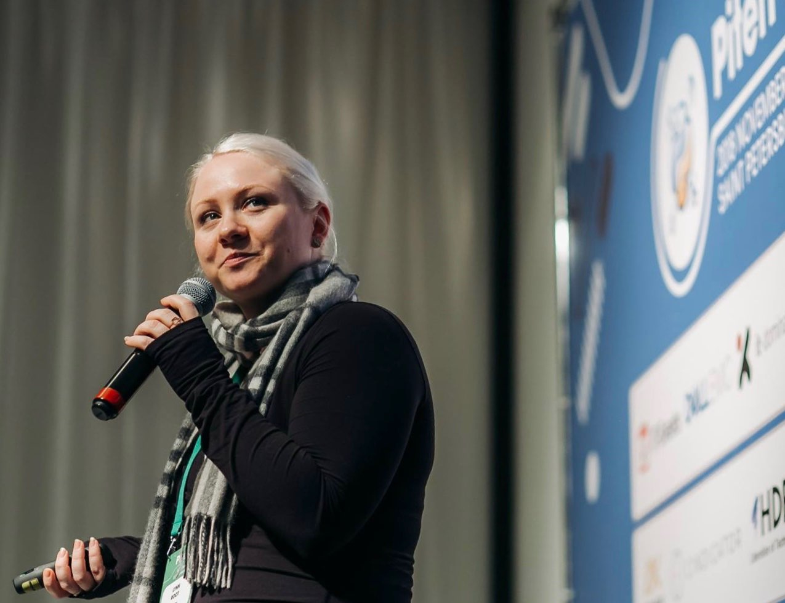
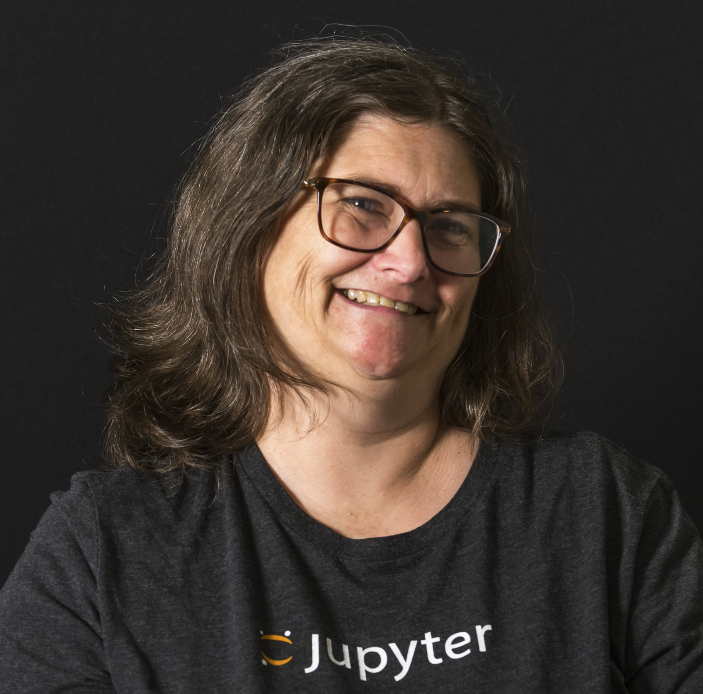

## Lynn Root

{: width="300" align=left}

Lynn Root is a Staff Engineer at Spotify and resident FOSS evangelist.
She is a seasoned speaker on building and maintaining distributed systems, and is currently spearheading governance compliance for Spotify's ML/AI platform.
Lynn is a global leader of diversity in the Python community, a member of the PyLadies Global Council, and the former Vice Chair of the Python Software Foundation Board of Directors.
When her hands are not on a keyboard, they are usually holding a bass guitar.

<iframe width="560" height="315" src="https://www.youtube.com/embed/Ww2-Cw9qnmE?si=rIUTSTsqarcGTQTN" title="Day 1 Keynote (Lynn Root) - PyTexas 2024" frameborder="0" allow="accelerometer; autoplay; clipboard-write; encrypted-media; gyroscope; picture-in-picture; web-share" referrerpolicy="strict-origin-when-cross-origin" allowfullscreen></iframe>

## Carol Willing

{: width="300" align=left}

Carol Willing is a three-time [Python](https://python.org) Steering Council member, a Python Core Developer, PSF Fellow, and a Project Jupyter core contributor.
In 2019, she was awarded the [Frank Willison Award](https://www.python.org/community/awards/frank-willison/#carol-willing-2019) for technical and community contributions to Python.
As part of the Jupyter core team, Carol was awarded the [2017 ACM Software System Award](https://en.wikipedia.org/wiki/ACM_Software_System_Award) for Project Jupyter's lasting influence.
She's also a leader in open science and open-source governance serving on [Quansight Labs](https://labs.quansight.org/) Advisory Board and the [CZI Open Science Advisory Board](https://chanzuckerberg.com/science/programs-resources/open-science/#advisory-board).
She's driven to make open science accessible through open tools and learning materials.
She recently served as [Noteable](https://noteable.io)'s VP of Engineering.

<iframe width="560" height="315" src="https://www.youtube.com/embed/rAMLQkY7TZM?si=2LLYPALeihrBrRga" title="Day 2 Keynote (Carol Willing) - PyTexas 2024" frameborder="0" allow="accelerometer; autoplay; clipboard-write; encrypted-media; gyroscope; picture-in-picture; web-share" referrerpolicy="strict-origin-when-cross-origin" allowfullscreen></iframe>

 

