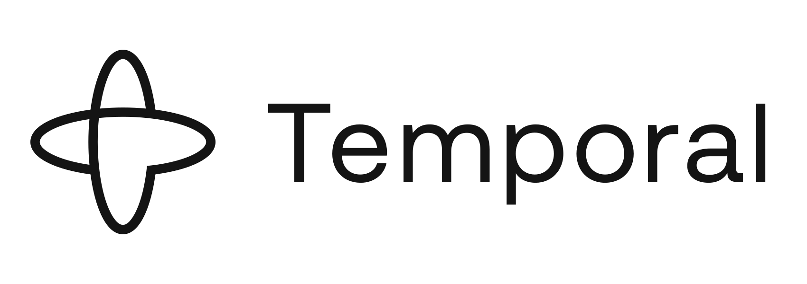
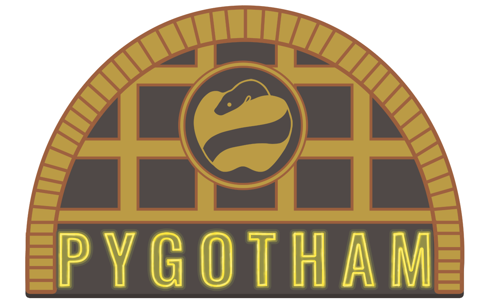
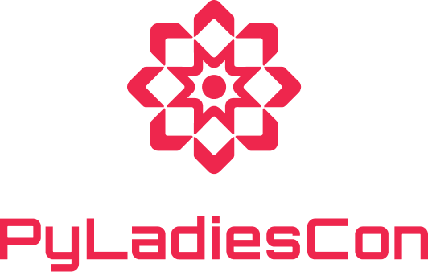
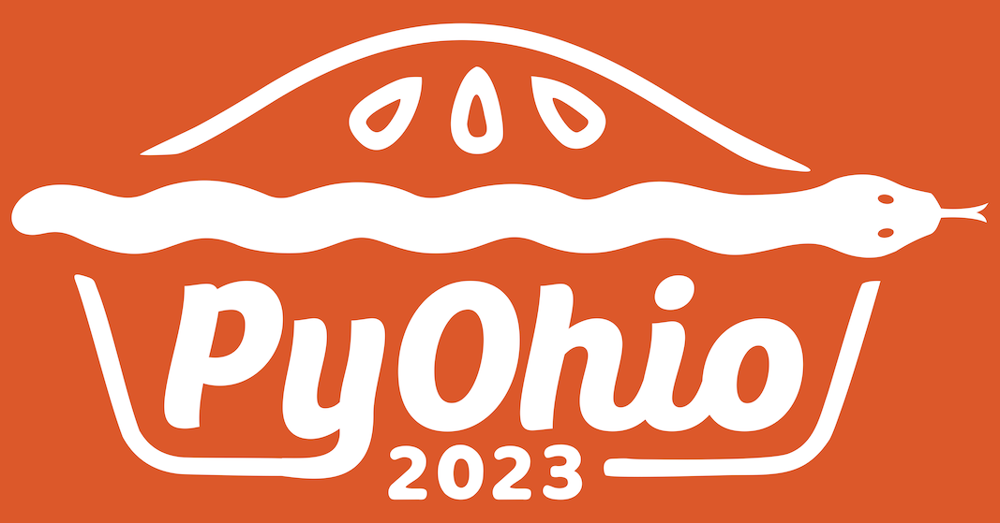

# PyTexas Conference 2024 Sponsors

## Gold Sponsors
[{: width="500" align="left"}](https://temporal.io)

 

## Lanyard Sponsors
[{: width="350" align="left"}](https://www.appsignal.com/)

 

## Community Sponsors

[{: width="200" align="left"}](https://devitjobs.com/jobs/python/all/all)

[{: width="325" align="left"}](https://2023.pygotham.tv/)

[{: width="300" align="left"}](https://conference.pyladies.com/index.html)

 

[{: width="300" align="left"}](https://www.pyohio.org/2023/)

[{: width="300" align="left"}](https://blackpythondevs.github.io/)
